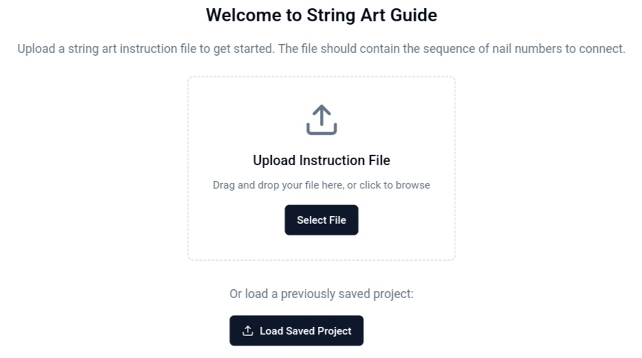
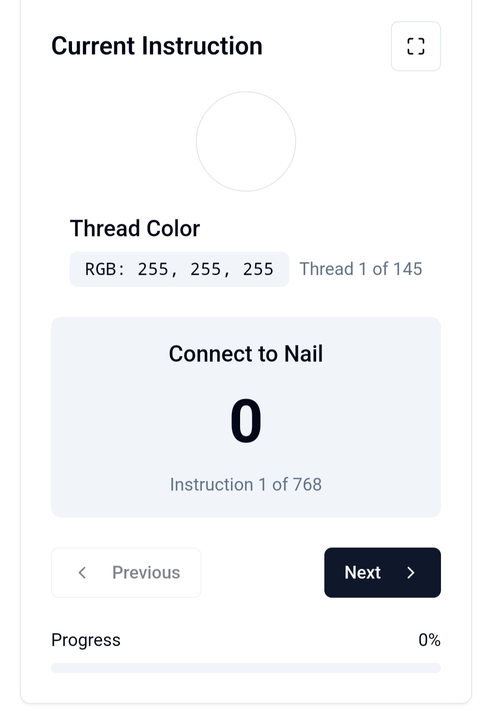
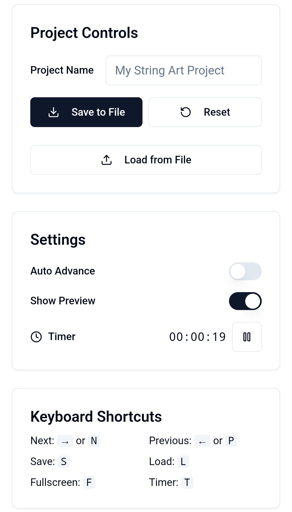
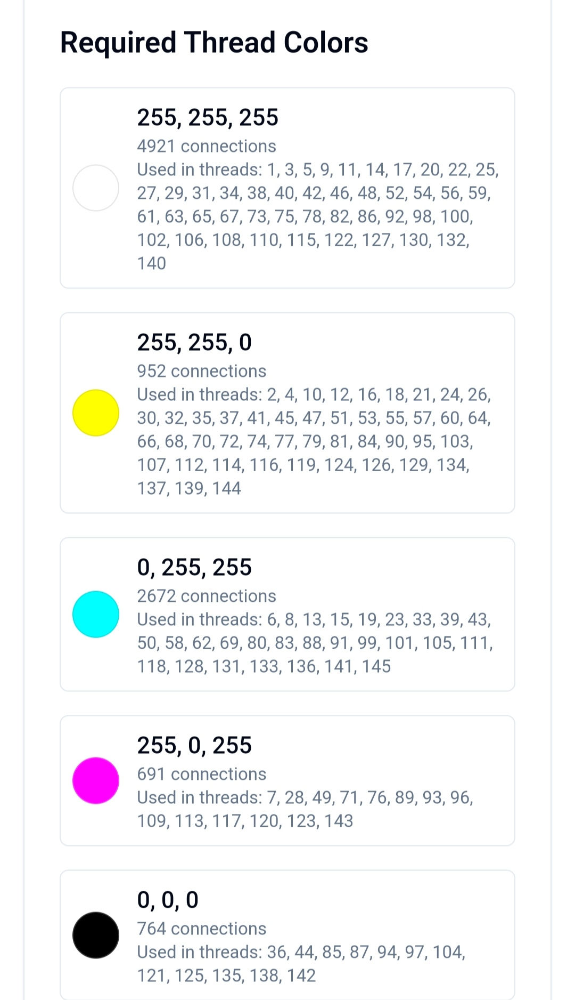
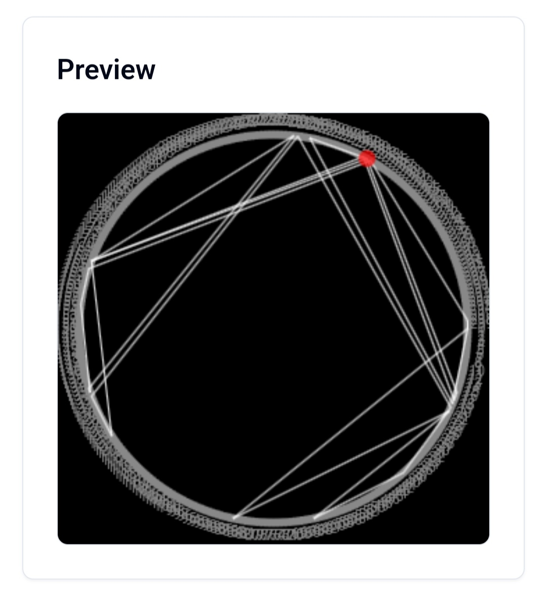

String Art Guide

Utilise l'outil de Mickael Crum pour guider l'utilisateur à travers le fichier d'instructions généré par son programme de string art.

Générateur de String Art en ligne : https://michael-crum.com/string-art-gen/

Code source du générateur : https://github.com/usedhondacivic/string-art-gen

Outil de guidage interactif : https://michael-crum-s-string-art-guide.netlify.app/

---

Description

String Art Guide est une application web conçue pour exploiter l'outil de Mickael Crum. Elle guide l'utilisateur pas à pas dans la réalisation de projets de string art en utilisant le fichier d'instructions généré par le programme. L'application offre une interface interactive et intuitive pour transformer vos idées en œuvres de string art.

---

Fonctionnalités

Gestion des projets

Création et sauvegarde : Créez un projet, sauvegardez-le au format JSON et chargez-le ultérieurement.

Réinitialisation : Réinitialisez votre projet pour recommencer à zéro.

Suivi interactif

Instructions en temps réel : Visualisez l'instruction courante, la couleur active et le clou à connecter.

Progression : Suivi détaillé du nombre d'instructions et du pourcentage de progression.

Minuterie intégrée : Suivez le temps de travail avec un minuteur affiché.

Modes d'affichage : Activez le mode plein écran pour une immersion totale.

Paramètres et contrôle

Avancement automatique : Passez automatiquement à l'instruction suivante.

Contrôle via raccourcis clavier :

Next : Passer à l'étape suivante.

Previous : Revenir à l'étape précédente.

Save / Load : Sauvegarder ou charger un projet.

Fullscreen / Timer : Activer/désactiver le mode plein écran ou la minuterie.

Gestion des couleurs de fil

Affichage des couleurs : Chaque couleur (en RGB) est affichée avec le nombre de connexions correspondantes.

Détails précis : Répartition détaillée des fils par numéro de clou.

---

Utilisation

String Art Guide vous permet de :

Charger un fichier d'instructions généré par l'outil de Mickael Crum.

Suivre pas à pas les instructions pour réaliser votre projet de string art.

Visualiser en temps réel la progression du projet, la couleur active et le clou cible.

Gérer votre projet via des commandes rapides (sauvegarde, chargement, réinitialisation, etc.) grâce à une interface intuitive.

Voir quelles couleurs de fils sont nécessaire au projet pour préparer votre matériel.

Avoir une visualisation dynamique de l'avancement du projet. 

